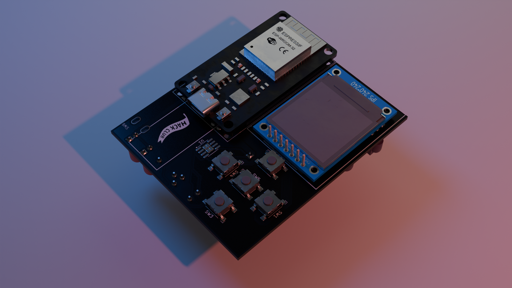
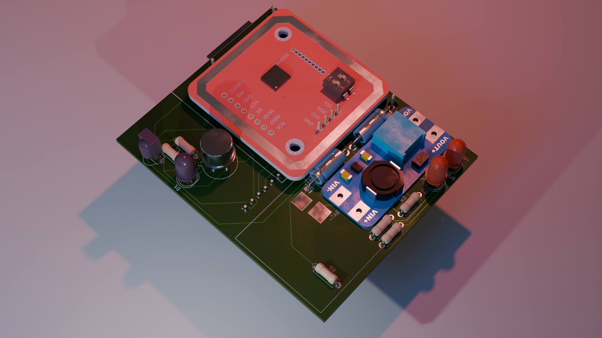
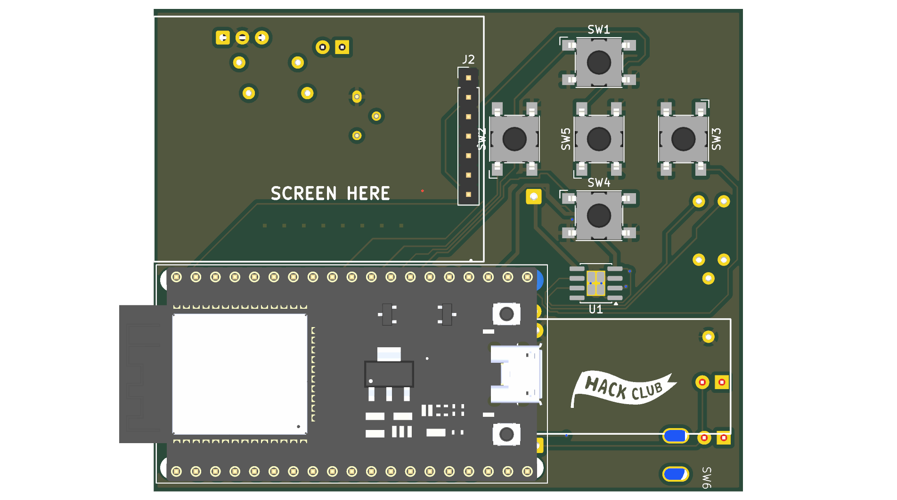
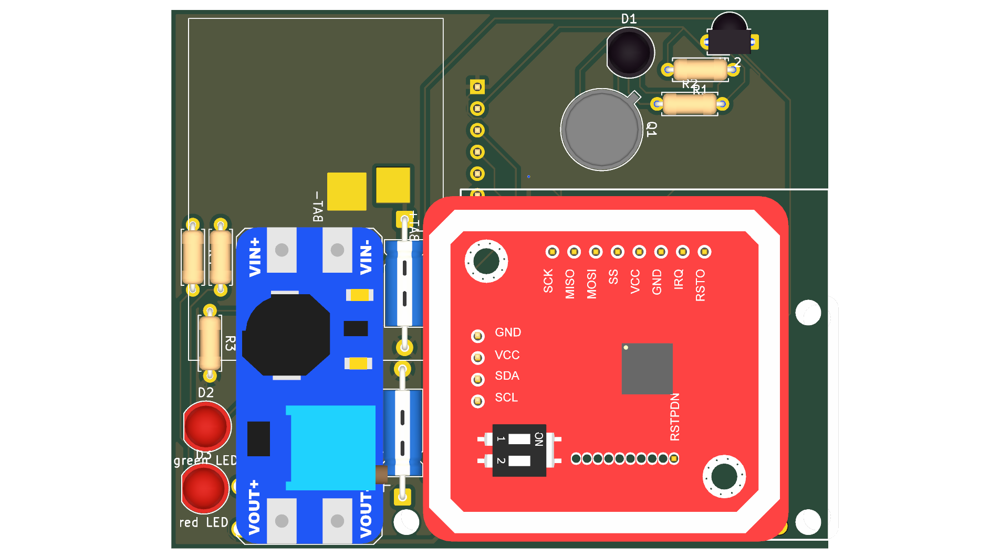
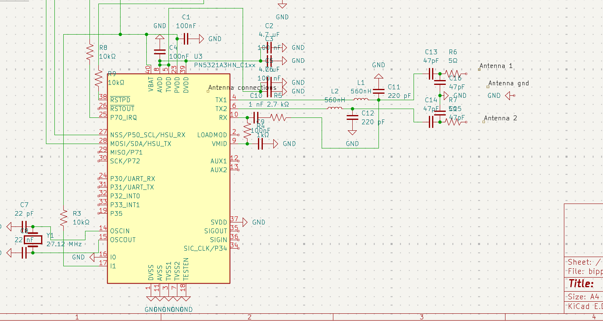
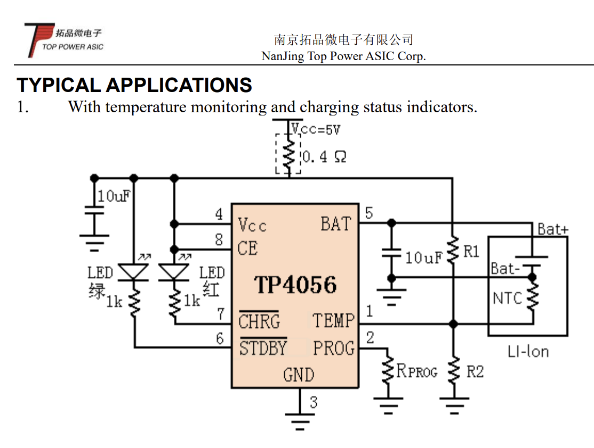
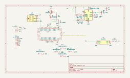
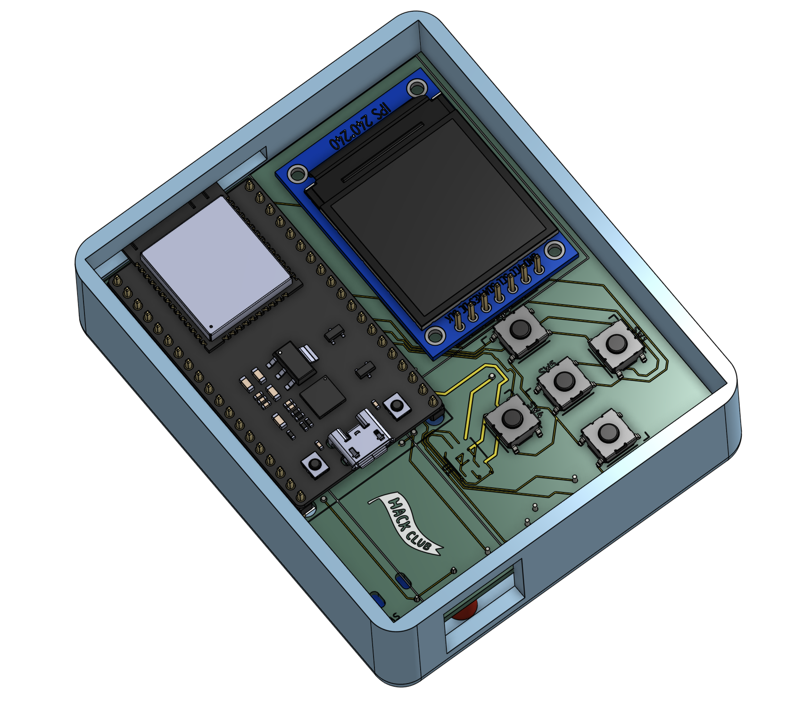
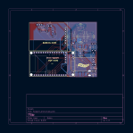

# flopper-one

# [NOTE TO THE REVIEWERS-- PLEASE READ!](docs/note.md)

<table width="100%">
    <tr>
        <td>
            
        </td>
        <td>
            
        </td>
    </tr>
</table>

Flipper zero-type firmware with an ESP32. Featuring IR, NFC, BLE, wifi, with a dpad and an lcd display. Not designed using any guide!

I've always thought that the flipper zero was pretty cool, but the $200 price point made it seem out of reach.

I joined up blueprint, made the [hackpad](https://github.com/JBlitzar/blitzypad), learned a lot and had a lot of fun.

Then I saw the [sorta flipper zero](https://blueprint.hackclub.com/projects/7192). This was truly inspring. I saw it, and I thought to myself, _I could totally do that_. And it turns out I have like half the parts! The ESP has wifi and bluetooth built in (you usually need to pay like $60 extra for wifi on a flipper), all that's left is to add... all the other stuff.

Since this is my second PCB project, I opted for a module build. In the end, this made the pcb quite crowded and taught me a lot about good routing (and I still had to use the smd TP4056 IC, you'll see later)

Basically, after the ESP, we need a UI, IR, NFC, and RFID.

The UI is some buttons in a dpad and a display.

IR is incredibly easy. It's literally an LED (with some passives sprinkled in), and then a TSOP38238 to recieve.

For NFC/RFID, I opted for the PN532 module. I breifly entertained the idea of using the bare PN532 chip and fully integrating it, but the [datasheet](https://www.nxp.com/docs/en/nxp/data-sheets/PN532_C1.pdf) is 222 pages long and the application circuit (page 212, figure 51) seems pretty involved if I do say so myself.

> _incomplete nfc circuit... yeah its pretty complicated_
>
> At this point it's cheaper AND smaller to just use the module. So that's what I did

Then I thought it'd be fun to add power management. _"fun."_ If only it was simple [like the xiao](https://wiki.seeedstudio.com/xiao_nrf54l15_sense_getting_started/#battery-powered-board)! I added the TP4056 IC because I was feeling fancy. I asked on slack, and it turns out you need a boost converter. To get your 3.7v battery up to 5v... so that it can go back down to 3.3v. I used a module for the boost converter. But I still got to add fun charging status LEDs! Also I got the "opportunity" to google translate Chinese datasheets.

I also discovered some... interesting hacks like how the VIN pin on the esp [is actually 5v out](https://esp32.com/viewtopic.php?t=11904) when the usb is plugged in. Meaning we can charge from VIN... and then later discharge also to VIN.

I added a physical switch to prevent backflow. So congratulations, users are now trusted with power supply logic!

## Schematic

## Assembly

IMPORTANT: See [CAD/README.md](CAD/README.md) for notes.

## PCB

## BOM in table format

see BOM.csv.

This BOM format has been [approved](https://hackclub.slack.com/archives/C09CMJV6V6K/p1770569396266989) by the blueprint team

| Item                        | Link                                                  | Cost  | Amount | total cost of | total | Gotten? |
| --------------------------- | ----------------------------------------------------- | ----- | ------ | ------------- | ----- | ------- |
|                             |                                                       |       |        |               | 32.15 | FALSE   |
| esp32 wroom                 | already own                                           | 0     | 1      | 0             |       | TRUE    |
| TSOP38238                   | https://www.lcsc.com/product-detail/C141632.html      | 0.73  | 1      | 0.73          |       | FALSE   |
| TSAL6200                    | https://www.lcsc.com/product-detail/C55528.html       | 0.83  | 1      | 0.83          |       | FALSE   |
| PN532                       | https://www.aliexpress.us/item/3256806254348567.html  | 0.99  | 1      | 0.99          |       | FALSE   |
| ST7789                      | https://www.aliexpress.us/item/2255799995721426.html  | 3.57  | 1      | 3.57          |       | FALSE   |
| 5x b3fs                     | https://www.lcsc.com/product-detail/C271750.html      | 1.07  | 1      | 1.07          |       | FALSE   |
| 5x TP4056 (moq)             | https://www.lcsc.com/product-detail/C16581.html       | 0.91  | 1      | 0.91          |       | FALSE   |
| lipo battery                | already own                                           | 0     | 1      | 0             |       | TRUE    |
| MT3608 module               | https://www.aliexpress.us/item/3256808032184992.html? | 6.77  | 1      | 6.77          |       | FALSE   |
| 5x PCB (moq)                | n/a                                                   | 5.3   | 1      | 5.3           |       | FALSE   |
| switch                      | already own                                           | 0     | 1      | 0             |       | TRUE    |
| 1kΩ resistor                | Can get for free                                      | 0     | 3      | 0             |       | TRUE    |
| 47-100Ω resistor            | Can get for free                                      | 0     | 1      | 0             |       | TRUE    |
| 1.2kΩ resistor              | Can get substitute for free                           | 0     | 1      | 0             |       | TRUE    |
| 10uf capacitor              | can get for free                                      | 0     | 2      | 0             |       | FALSE   |
| 2n2222a (2n2219 substitute) | https://www.lcsc.com/product-detail/C118536.html      | 0.77  | 1      | 0.77          |       | FALSE   |
| LEDS (green, red)           | already own                                           | 0     | 2      | 0             |       | TRUE    |
| header pins                 | can get for free                                      | 0     | 2      | 0             |       | FALSE   |
| aliexpress shipping         | n/a                                                   | 0     | 1      | 0             |       | FALSE   |
| lcsc shipping               | n/a                                                   | 11.21 | 1      | 11.21         |       | FALSE   |
