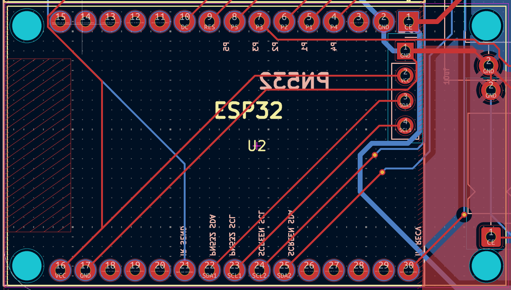

# TODO fr

reflow all joints

Wire a new mt3608 bodge with the new module. You'll need to bodge across, swapping + and - on both vin and vout.

Cut the corner pins off of the board. Melt the plastic and cut the metal?

the EN ESP PIN should lead nowhere.

The gp23 ESP PIN should lead to the pad under the VIN pin

The VIN ESP PIN should lead to the pad under the 3v3 pin

The 3v3 ESP PIN should lead to the pad under the en pin.

In kicad-speak:

> Traces that currently go to vcc, go to en.
> Traces that currently go to gp 23, go to vin.
> Traces that currently go to vin, go to 3v3

Change the pins in the header file to match the scam mirrored pinout.

solder in the lcsc parts

cross fingers!

