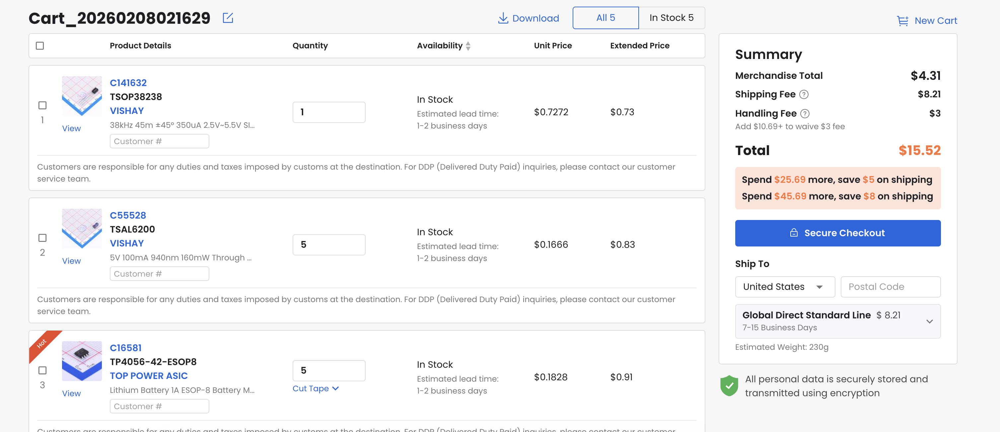
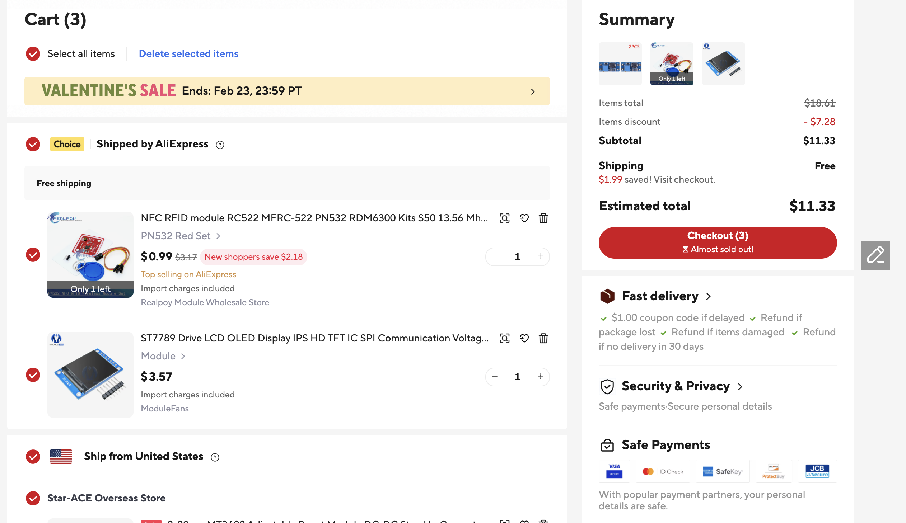

hi, wanted to make sure you read this I guess

Made a few changes after pressing submit, but everything should be updated in this repo.

Switched from aliexpress to lcsc for some of the passives. This means that my cart screenshots are out of date.

The corrected cart screenshots for LCSC and aliexpress are below.

The BOM in the readme and in BOM.csv is up to date with these changes.

I also added ground pours, which makes the pcb renders in the README kind of unreadable. you can open up the kicad project to see it for real.
